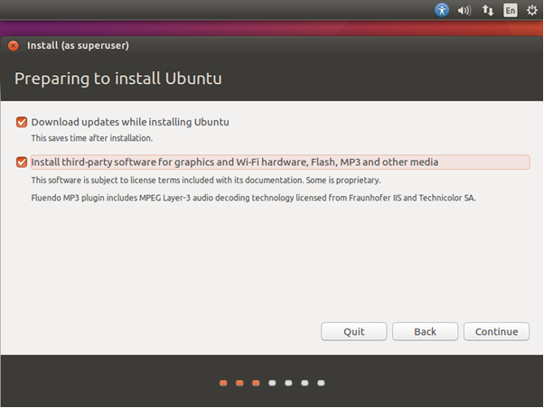
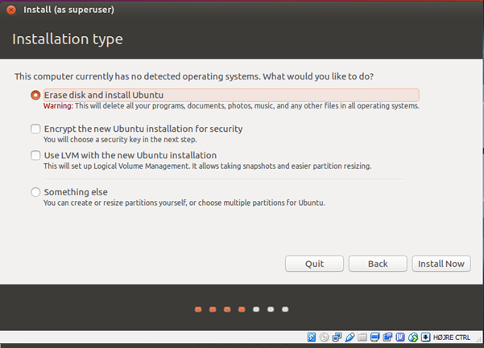
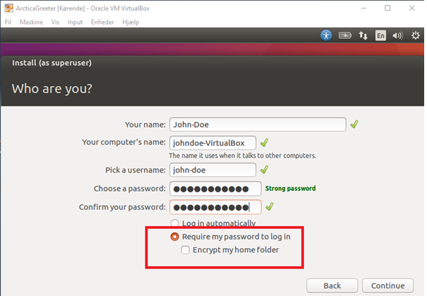
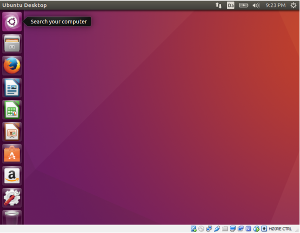
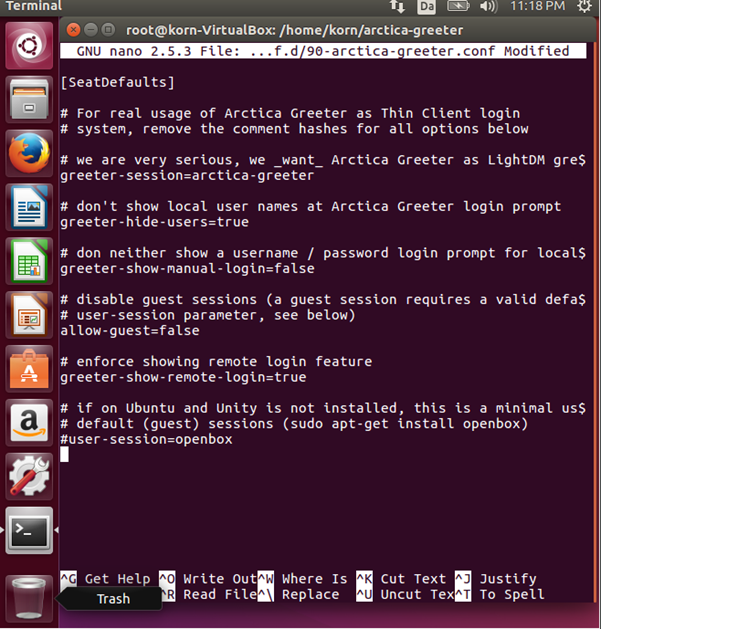

## Arctica Greeter - Installation Guide for Ubuntu 16.04 LTS (Latest version

# Introduction

The following document, documents how to install Ubuntu with Arctica Greeter. Make sure when typing the commands for installation, since Ubuntu differ between uppercase and lowercase letters because everything is case-sensitive. Everything that is highlighted with a black background is what you would type in the Terminal.

## Stage one
 
**Install Ubuntu:**
When installing Ubuntu make sure to check both boxes, **"Download Updates While Installing Ubuntu"** and **"Installation of 3rd party applications"**, when they both are ticked then press continue. 


Next step choose **"Erase Disk"** and press Install Now.
If it asks you **“Write the changes to disk?”**, ignore it and press continue.



Next choose location where you live, after the location has been chosen you will get the opportunity to choose your keyboard layout so it can fit to your language.

At the end it will ask you to fill in a form with name, computer name, username and password. Make sure that you do not login automatically since it will give complications with login on Arctica Greeter.



Restart, when the installation is done.

## Stage two

After Ubuntu is successfully installed open a terminal either by pressing **"CTRL+ALT+T"** or navigate to **“Search your computer”** and search for terminal.




When the **“Terminal”** appears you will see a window similar to the picture below.


Now that the **“Terminal”** is open, run the following commands:

```
$ sudo -i
```

This will give you access as an Admin/Superuser/Root.

**NOTE 1:** After the command ``sudo -i`` the computer will ask you for a password, the password is the same you are using for your login. Also note that it will not show your password when typed, it will instead keep a blank field while typing, so type it carefully and press enter.

**NOTE 2:** you can distinguish between Admin and User in the Terminal (and also in this document). A user has a `$-sign` when you are logged in a user, and `#-sign` if you are**

```
# apt-get update
```

This will give you the latest available package versions in the repositiory.

When it is done with getting the latest package version, you will need to download and install them. Then...

```
# apt-get upgrade
```

This will download and Install the updates, this might take some time to complete. **NOTE:** it will ask you at the end if you want to continue, for this type **"y"** and press enter.


## Stage three 

While you are still logged in as Admin/Superuser/ROOT you will need to add the repository.

Type following:
```
nano /etc/apt/sources.list
```

Head to the bottom and press enter to insert new line and type following:

```
deb http://packages.arctica-project.org/ubuntu-nightly xenial main
```

Now write out the repository by pressing **"CTRL+O"**, it will ask you to give the **File Name to Write** press enter to that.

After you have saved it, press **"CTRL+X"** to exit the repository.

You should now be back in the Terminal, type the following command to fetch the key from a server:

```
apt-key adv --keyserver keyserver.ubuntu.com --recv-keys A8680F5598DE3101
```

It will tell you that a **RSA: 1 is imported** if it succeeded to import the key.

Next you need to install git, type following command, it will ask you if you want to continue type **"y"** and press enter:

```
apt-get install git
```

When the installation of Git is done, you will need to create a folder in order to clone git so they are collected in one folder. Therefore you need to type following command so you can create a folder:

```
mkdir arctica-greeter
```

Now open the folder that you just created by using following command:

```
cd arctica-greeter
```

Now you are able to clone the 4 repositories from ArcticaProject, so type following lines one by one:

```
git clone https://github.com/ArcticaProject/arctica-greeter/

git clone https://github.com/ArcticaProject/libpam-x2go/

git clone https://github.com/ArcticaProject/lightdm-remote-session-x2go/

git clone https://github.com/ArcticaProject/remote-logon-service/
```
If done correctly then the Terminal will tell you, **"Checking connectivity… done"**.


## Stage Four 

Comment from sunweaver: CONTENT adaptation!!! Just provide one long apt-get line per source package that pulls in all required packages. IIRC, there also is a tool that reads build-deps from a debian/control file. This section can be improved!


Install the dependencies for the four packages which you acquired from Git. For this you will need to run the command `apt-get install` on the following packages. When installing it will sometimes ask you if you want to continue type **"y"** and press enter.

**Example:**

```
# apt-get install debhelper
# apt-get install dh-autoreconf
# etc. etc. etc. 
```

The following packages that need to be installed:
```
# apt-get install debhelper
# apt-get install dh-autoreconf
# apt-get install fonts-droid-fallback
# apt-get install gnome-common
# apt-get install gnome-settings-daemon-dev
```

In order to install libayatana you will need to update the packages type following:
```
# apt-get update
```

Now carry on with `apt-get install` followed by the command.

```
# apt-get install libayatana-ido3-0.4-dev
# apt-get install libayatana-indicator3-dev
# apt-get install libcanberra-dev
# apt-get install libgnome-desktop-3-dev
# apt-get install libgtk-3-dev
# apt-get install liblightdm-gobject-1-dev
# apt-get install valac
# apt-get install xvfb
# apt-get install fonts-cantarell
# apt-get install fonts-cabin
# apt-get install gnome-settings-daemon
```

Install libpam-x2go dependencies, use the same command `apt-get install` followed by the dependencies:

```
# apt-get install libgtest-dev
# apt-get install libpam0g-dev
# apt-get install libssh-dev 
# apt-get install cdbs 
# apt-get install socat
# apt-get install pyhoca-cli
```
 
Install the lightdm-remote-session-x2go dependencies, use the same command `apt-get install` followed by the dependencies:

```
# apt-get install dh-apparmor
```
 
install remote-logon-service dependencies, use the same command `apt-get install` followed by the dependencies:

```
# apt-get install dbus-test-runner  
# apt-get install libdbustest1-dev
# apt-get install libgcrypt11-dev 
# apt-get install libjson-glib-dev 
# apt-get install libnm-glib-dev
# apt-get install libsoup2.4-dev
```

## Stage five

Install the devscripts, using same command `apt-get install` followed by the dependence:

```
# apt-get install devscripts
```

Now navigate to each repository folder that was created, in order to open the folders you will need to type `cd` in front of each folder, though to go back one folder you will need to type `cd ..`

Type following:

```
cd arctica-greeter
```

Now you are in the folder here you will need to run the command:

```
debuild –uc –us
```

exit the folder by typing `cd ..` and navigate to the other folders and do the same

```
cd libpam-x2go
cd lightdm-remote-session-x2go
cd remote-logon-service
```

Go back to the folder where the 4 repositories were created using the command `cd ..` and install the created packages:

```
sudo dpkg -i *.deb
```

In same folder install thin-client-config-agent:

```
# apt-get install thin-client-config-agent
```

## Stage six 

Open the following file, by typing:
```
nano /etc/lightdm/lightdm.conf.d/90-arctica-greeter.conf
```
        
Remove the **"#"** on the following lines:

```
#greeter session=arctica-greeter
#greeter-show-manual-login=false
```

So the file will look similar to the picture below.


Now press **"CTRL+O"**  and press enter to save the file, afterwards exit it by pressing **"CTRL+X"**.

Now test the Connection to the server and type following:

```
pyhoca-cli --new  --server 92.246.17.152  --port 58005 --user testuser --pass testuser  --command UNITY
```
If you connect then an x2go session will start and it will show you a new desktop. Exit the desktop by logging out and the press **"CTRL+C"**.

Now edit the environment file, open the file by typing:

```
nano /etc/environment
```

In the environment press down arrow in order to go to a new line and insert following line:

```
SERVER_ROOT=http://92.246.17.152:8080/uccs/inifile/
```

Now press **"CTRL+O"** and press enter to save the file, afterwards exit it by pressing **"CTRL+X"**.

Now run following commands, though NOTE: username and password are both testuser, also when typing password and username do not include **<>**.

```
export SERVER_ROOT
```

Type exit and press enter this will put you back to the very beginning, log back in as an Admin/Superuser/ROOT by typing following:

```
sudo su
```
type your password as you did in the beginning.

Now type following to get information about remote desktop servers:

```
echo <password> | thin-client-config-agent <username>
```

In your case it could look like:

```
echo testuser | thin-client-config-agent testuser
```

In order to connect to a remote server you have to tell it which IP to ping, therefore open the remote-logon-service file by typing following:

```
nano /etc/remote-logon-service.conf
```

Change the line 
`URI=http://localhost:8080/uccs/inifile/` to:

```
URI=http://92.246.17.152:8080/uccs/inifile/
```
**"CTRL+O"**  and press enter to save the file, afterwards exit it by pressing **"CTRL+X"**.

Type **"exit"** in order to logout as Admin, type **"exit"** again so it will close the Terminal. Restart the system and you will see Arctica Greeter as your login screen.

## Additional notes, how to change resolution

http://code.x2go.org/doc/pyhoca-cli/man/man1/pyhoca-cli.1.html jan@fleten.net @ 12:38

look at -g --geometry 12:38

-g, --geometry {<WIDTH>x<HEIGHT>|fullscreen|maximize} 12:38

this is pyhoca-cli commands