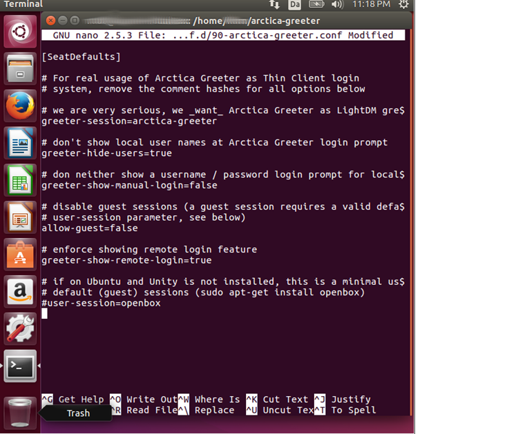

## Arctica Greeter - Installation Guide

# Preamble

The installation currently only supports Ubuntu 16.04 LTS as underlying operating system. We are working on "freeing" Arctica Greeter and making it available on more platforms.

# Introduction

The following document, explains how to install Arctica Greeter with its Remote Logon feature. Everything that is highlighted with a black background is what you would type in the Terminal.

Currently, only remote X2Go sessions are support by Arctica Greeter's Remote Logon feature. We are working on native Arctica support and plan to support FreeRDP logins to remote Windows Servers, as well. So stay tuned.

# Concept

Arctica Greeter has some code that contacts a DBus service called Remote Logon Service. This Remote Logon Service can talk to a remote broker server, formerly known as UCCS server. The UCCS server concept was invented and then later on dropped by Canonical. It was part of Ubuntu 12.04 and 14.04 and has been discontinued since then.

The X2Go project came up with a broker that supports the UCCS communication protocol. So Arctica Greeter via Remote Logon Service can talk to the UCCS frontend in the X2Go Session Broker.

The X2Go Session Broker is the first login stage when using Remote Logon in Arctica Greeter. From the broker you then get presented a list of attached X2Go (and RDP) servers that are available for Remote Session Logon.

The second logon stage then queries username and password for the remote X2Go / RDP server. Once credentials have been given, a remote desktop session should start up that allows you working on a remote Linux (or Windows) machine.

**Note:** This document does not cover the installation and configuration of an X2Go Session Broker host. Consult X2Go documentation and the detailled comments in the X2Go Session Broker's configuration files.

# HowTo

## Stage one: Installing the System

### Install Ubuntu GNU/Linux

When installing Ubuntu make sure to check both boxes,

  * **"Download Updates While Installing Ubuntu"** and
  * **"Installation of 3rd party applications"**.

 Once they both are ticked, press continue.


Next step, choose **"Erase Disk"** and press **"Install Now"**. If it asks you
**Write the changes to disk**, acknowledge it and press continue.


Next, choose location where the installed system will be deployed. After the location has been chosen you will get the opportunity to choose your keyboard layout so it can fit your language.

Finally, the installer will ask you to fill in a form with name, computer name, username and password. Make sure that you do not choose automatic login
since it will give complications when setting up Arctica Greeter.


Restart the computer, when the installation is done.

## Stage two: Upgrade the System

After Ubuntu has been successfully installed, log into the system and open a terminal either by pressing **"CTRL+ALT+T"**.


When the **"Terminal"** appears you will see a window similar to the
picture below.


Now that the **"Terminal"** is open, run the following commands:

```
$ sudo -i
```

This will give you Super-User "root" access. You are now administrator of the system and can break virtually everything. So beware!

**NOTE 1:** After the command ``sudo -i`` the computer will ask you for a
password, the password is the same you are using for your login. Also
note that it will not show your password when typed, it will instead keep
a blank field while typing, so type it carefully and press enter.

**NOTE 2:** you can distinguish between Admin and User in the Terminal
(and also in this document). A normal logged-in user has a ``$-sign`` in the command line prompt, whereas you see a ``#-sign`` if you are logged in as Super-User "root".

Prepare for getting new packages, update the lists of available distribution packages.

```
apt-get update
```

Before doing anything we will double-check that the system is up-to-date:

```
# apt-get upgrade && apt-get dist-upgrade
```

This will download and install all available updates, this might take some time to complete.

**NOTE:** The APT command will ask you twice if you want to continue, for this type **"y"** and press enter.

## Stage three: Install Arctica Greeter (from pre-built binaries or source)

### Install pre-built Binary Packages

**Note for beginners:** Be aware that, when typing the various commands during installation, Linux differs between uppercase and lowercase characters. Everything is case-sensitive. Better copy+paste command lines from this HowTo anyway, it is less error-prone.

As Super-User "root" add the repository where to obtain Arctica Greeter from. Type the following:

```
# echo "deb http:p//packages.arctica-project.org/ubuntu-nightly xenial main" > /etc/apt/sources.list.d/arctica.list
```

Next, add the Arctica Project's archive key to your local APT keyring. This assures that downloaded packages are really provided by the Arctica Project.

```
# apt-key adv --keyserver keyserver.ubuntu.com --recv-keys A8680F5598DE3101
```

It will tell you that a ``RSA: 1 is imported`` if it succeeded to import
the key.

Now install all related packages:

```
# apt-get install arctica-greeter
```

### Alternatively: Install Arctica Greeter and Components from Source

If you are a developer, you maybe want to build and install Arctica Greeter and its comonents from source.

First thing you need is: Git, type the following command, it will ask you if you want to continue, type **"y"** and press enter:


#### Build Environmnet Setup

```
# apt-get install git
```

When the installation of Git is done, you will need to create a folder cloning the Arctica Project's Git repositories (so that they are collected in one folder):

```
$ mkdir Development/ArcticaGreeter
```

Now enter the folder that you just created by using the following command:

```
$ cd Development/ArcticaGreeter
```


#### Obtaining Arctica Greeter Source Code from Git

Now clone 4 Git repositories from ArcticaProject:

```
$ git clone https://github.com/ArcticaProject/arctica-greeter/
$ git clone https://github.com/ArcticaProject/libpam-x2go/
$ git clone https://github.com/ArcticaProject/lightdm-remote-session-x2go/
$ git clone https://github.com/ArcticaProject/remote-logon-service/
$ git clone https://github.com/ArcticaProject/remote-logon-config-agent/
```

If you have a valid Github account with SSH public key uploaded to Github, you can also use the SSH transport:

```
$ git clone git@github.com:ArcticaProject/arctica-greeter.git
$ git clone git@github.com:ArcticaProject/libpam-x2go.git
$ git clone git@github.com:ArcticaProject/lightdm-remote-session-x2go.git
$ git clone git@github.com:ArcticaProject/remote-logon-service.git
$ git clone git@github.com:ArcticaProject/remote-logon-config-agent.git
```

If done correctly, the Terminal will tell you, **"Checking connectivity... done"** for each ``git clone`` command.

As we will ``.deb`` packages directly from the upstream source code, we also need the ``debuild`` utility on Ubuntu. This we find in the ``devscripts`` package:

```
# apt-get install devscripts build-essential
```


#### Installing Build-Dependencies

Install the build-dependencies for the four packages just cloned from Github. For this, you need to run the command ``apt-get install`` on the following packages. When installing it will sometimes ask you if you want to continue type **"y"** and press enter.

Before you start, make sure your APT package lists are up-to-date:

```
# apt-get update
```

The following packages are needed for building **arctica-greeter**:

```
# apt-get install debhelper dh-autoreconf   \
                  fonts-droid-fallback      \
                  gnome-common              \
                  gnome-settings-daemon-dev \
                  libayatana-ido3-0.4-dev   \
                  libayatana-indicator3-dev \
                  libcanberra-dev           \
                  libgnome-desktop-3-dev    \
                  libgtk-3-dev              \
                  liblightdm-gobject-1-dev  \
                  valac                     \
                  xvfb                      \
                  fonts-cantarell           \
                  fonts-cabin
```

The following packages are needed for building (and running) **libpam-x2go**:

```
# apt-get install libgtest-dev \
                  libpam0g-dev \
                  libssh-dev \
                  cdbs \
                  socat \
                  pyhoca-cli
```

The following packages are needed for building **lightdm-remote-session-x2go**:

```
# apt-get install dh-apparmor
```

The following package are needed for building **remote-logon-service**:

```
# apt-get install dbus-test-runner \
                  libdbustest1-dev \
                  libgcrypt11-dev  \
                  libjson-glib-dev \
                  libnm-glib-dev   \
                  libsoup2.4-dev
```

The following package are needed for building **remote-logon-config-agent**:

```
# apt-get install debhelper         \
                  python3-all       \
                  python3-pycurl    \
                  python3-setuptools
```


## Building from Source

Now navigate to each cloned Git working-copy folder. In each folder, run the ``debuild`` command. The ``debuild`` command will generate a lot of output in the terminal window.. After the build, you should find some (more) ``.deb`` package in the parent folder (i.e. ``~/Development/ArcticaGreeter``).

### Building Arctica Greeter

```
# cd arctica-greeter
# debuild -uc -us
# cd ..
```

### Building libpam-x2go

```
# cd libpam-x2go
# debuild -uc -us
# cd -
```

### Building LightDM Remote Session Support for X2Go

```
cd lightdm-remote-session-x2go
debuild -uc -us
cd ..
```

### Building Remote Logon Service

```
cd remote-logon-service
debuild -uc -us
cd ..
```

### Building Remote Logon Config Agent

```
cd remote-logon-config-agent
debuild -uc -us
cd ..
```

In the folder where all the Git repositories were created (the folder that you should be in now), you can find various ``.deb`` packages that got created by the ``debuild`` command calls. Install them all.

```
# sudo dpkg -i *.deb
```


## Stage six: Configuration of Arctica Greeter with Remote Logon Feature

Open a **"Terminal"** window and edit the following file, by typing:

```
# nano /etc/lightdm/lightdm.conf.d/90-arctica-greeter.conf
```

Remove the **"#"** on the following lines:

```
#greeter session=arctica-greeter
#greeter-show-manual-login=false
```

So the file will look similar to the picture below.


Now press **"CTRL+O"**  and press enter to save the file, afterwards exit it by pressing **"CTRL+X"**.

**Note:** Of course, you can use any other text editor you like. We have tried to keep the configuration part as simple and guiding as possible. Advanced Linux administrator may apologize the over-verbosity in this passage.

In order to connect to a remote UCCS server (we use an X2Go Session Broker for this) you have to tell the Remote Logon Service the broker's hostname or IP address, therefore open the ``remote-logon-service.conf`` file by typing following:

```
# nano /etc/remote-logon-service.conf
```

Change the line `URI=http://localhost:8080/uccs/inifile/` to:

```
URI=http://<broker>:8080/uccs/inifile/**
```
**"CTRL+O"**  and press enter to save the file, afterwards exit it by pressing **"CTRL+X"**.

Type **`exit`** in order to logout as Admin, type **`exit`** again so it will close the Terminal. Restart the system and you will see Arctica Greeter as your login screen.

Make sure that the remote X2Go Session Broker has UCCS frontend suppor enabled (see ``/etc/x2go/x2gobroker.conf``).

Restart the system and you should see Arctica Greeter starting up, offering you a Remote Logon.

## Stage seven: TROUBLESHOOTING

### No Remote Logon box in Arctica Greeter

Let's see if the communication between your system and the broker works, type this in a **"Terminal"** window:

```
# export SERVER_ROOT=http://<broker-address>:8080/uccs/inifile/
```
Now type the following to get information about remote desktop servers from the session broker. Ideally, on the broker, create a test account with some dummy password for this. (Or make sure to wipe ``.bash_history`` after issuing the below command):

```
# echo <password> | remote-logon-config-agent <username>
```

### Remote X2Go Sessions not coming up

If Arctica Greeter does presents you with a Remote Logon box, but you cannot start any remote X2Go sessions, you can try this from the command line:

```
# pyhoca-cli --new  --server <address>  --port <port> --user <user> --pass <user>  --command <desktop> --terminate-on-ctrl-c
```

Replace the expressions in pointed brackets by:

  * **<address>**: Remote X2Go Server's IP address or hostname
  * **<port>**: TCP/IP port of the remote X2Go server'S SSH daemon
  * **<user>**: a valid username on the remote X2Go server (one that login via SSH already)
  * **<pass>**: the user's password
  * **<desktop>**: a desktop environment name, e.g. MATE, UNITY, KDE, LXDE, XFCE (etc.)

If the command execution above is successful, an X2Go session will start up and it will show you the chosen remote desktop session. Exit the desktop session by pressing **`"CTRL+C"`**.
